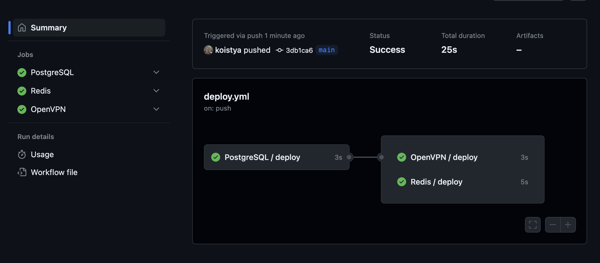
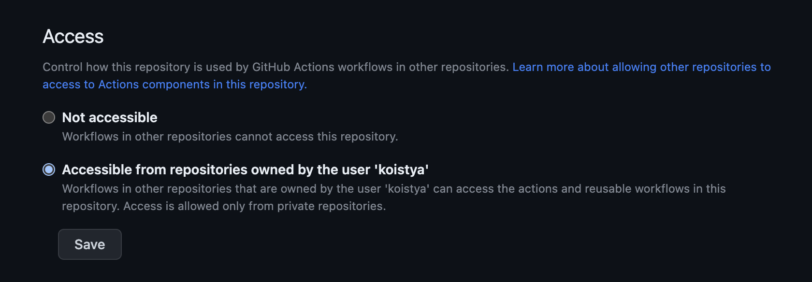

# GitHub Actions Playground

[](https://github.com/koistya/temp/actions)

The following example demonstrates the concept of "reusable workflows" in GitHub Actions.



### Directory Structure

- [`.github/actions`](./.github/actions/) — composite actions
- [`.github/workflows`](./.github/workflows/) — GitHub Actions workflows
  - [`deploy.yml`](./.github/workflows/deploy.yml) — parent workflow
  - [`deploy-postgres.yml`](./.github/workflows/deploy-postgres.yml) — child workflow
  - [`deploy-redis.yml`](./.github/workflows/deploy-redis.yml) — child workflow
  - [`deploy-vpn.yml`](./.github/workflows/deploy-vpn.yml) — child workflow

### `.github/workflows/deploy.yml`

```yml
name: Deploy

on:
  push:
    branches: [main]

jobs:
  postgres:
    name: "PostgreSQL"
    uses: ./.github/workflows/deploy-postgres.yml
  redis:
    name: "Redis"
    uses: ./.github/workflows/deploy-redis.yml
    needs: [postgres]
  vpn:
    name: "OpenVPN"
    uses: ./.github/workflows/deploy-vpn.yml
    needs: [postgres]
```

- Declares the list of jobs that reference child workflows
- Declares the execution order of the jobs using dependencies (`needs`)
- Uses short job IDs plus descriptive names
- Fires up on push to the `main` branch

### `.github/workflows/deploy-redis.yml`

```yml
name: Deploy Redis

on: workflow_call

jobs:
  deploy:
    runs-on: ubuntu-latest
    steps:
      - uses: actions/checkout@v3
      - run: 'echo "Step 1"'
      - run: 'echo "Step 2"'
      - run: 'echo "Step 3"'
```

- Declares a reusable workflow that can be called from other workflows

### Using External Workflows

- Create `actions` repository under your GitHub account (e.g. `koistya/actions`)
- Create reusable workflows in the `.github/workflows` folder (e.g. `.github/workflows/deploy.yml`)
- Create composite actions in the root folder (e.g. `create-pod/action.yml`)
- Allow access to actions/workflows in the `actions` repository from external repos



Reference external workflows and composite actions as shown in this example:

```yml
name: Deploy

on:
  push:
    branches: [main]

jobs:
  postgres:
    name: "PostgreSQL"
    uses: example/actions/.github/workflows/deploy-postgres.yml@main
  other:
    runs-on: ubuntu-latest
    steps:
      - uses: actions/checkout@v3
      - uses: example/actions/create-pod@main
```

Where `example/actions` is the repository containing external workflows such as `koistya/actions` and `@main` is the branch name or a tag.

### References

- [GitHub Actions](https://docs.github.com/en/actions) → [Reusable Workflows](https://docs.github.com/en/actions/using-workflows/reusing-workflows)
- [GitHub Actions](https://docs.github.com/en/actions) → [Composite Actions](https://docs.github.com/en/actions/creating-actions/creating-a-composite-action)

```

```
